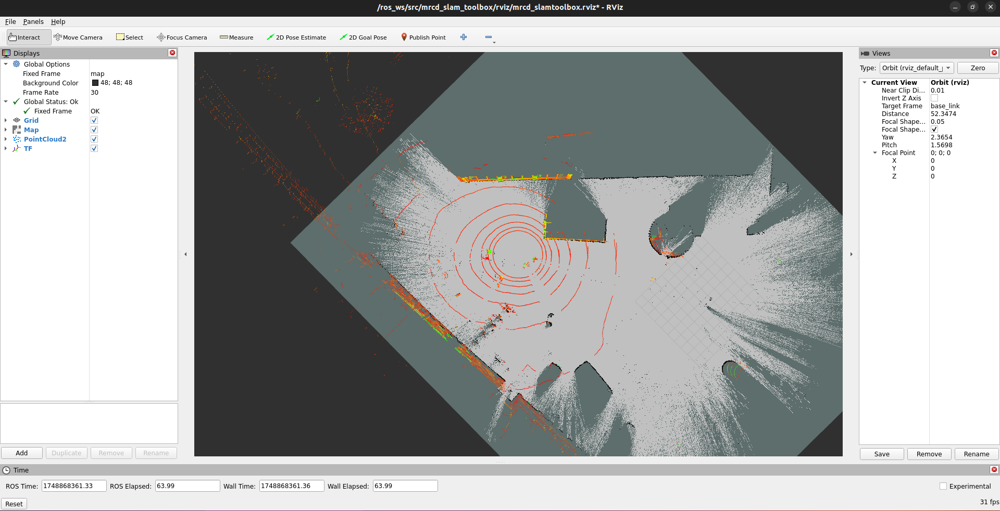
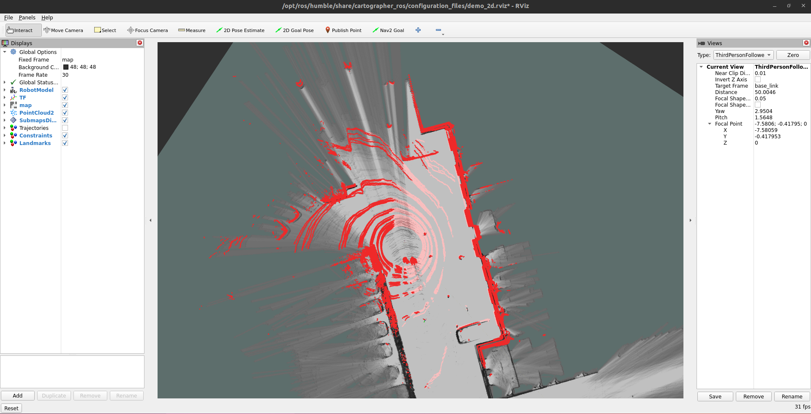
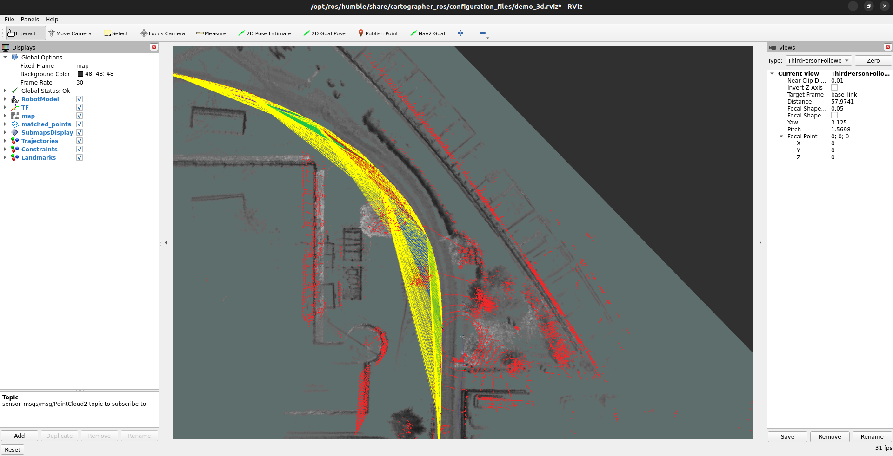
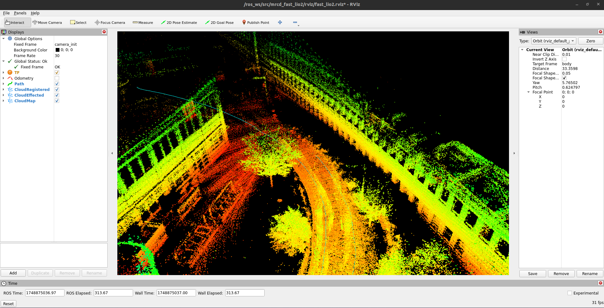

# SLAM Tutorial
MRCD was tested using a handful of state-of-the-art SLAM algorithms, which demonstrate the capabilities of the recorded dataset.

## Algorithms
We provide ROS2-Humble Docker images for each algorithm, which can be downloader here [LINK?]. Please find the list and according Repositories we used below.

### LiDAR-Inertial SLAM

#### [Nav2 SLAM Toolbox](https://github.com/SteveMacenski/slam_toolbox)

* Navigate to the directory containing the SLAM Toolbox docker container archive and run the following command to convert the archive into a runnable docker container. 
* Substitute:
    * `<image_name>`: Name under which the image should be saved on your machine.
    * `<image_version>`: Version of the generated image. Defaults to 'latest'.

```bash
sudo docker import mrcd_slamtoolbox_container.tar <image_name>:<image_version>
```

* Run the imported image as a docker container with the following command. 
* Substitute:
    * `<path_to_bag_files>`: Path to directory holding the downloaded dataset sequences.
    * `<container_name>`: Name under which the container should be saved on your machine.
    * `<image_name>`: Image name selected in previous step.
    * `<image_version>`: Image version selected in previous step.

```bash
sudo docker container run -it \
    -v <path_to_bag_files>:/dataset_files/ \
    --name <container_name> \
    --net=host \
    --privileged \
    --env="DISPLAY=$DISPLAY" \
    --volume="${XAUTHORITY}:/root/.Xauthority" \
    <image_name>:<image_version>
```

* Open additional 3 additional terminals for the running container.
* Substitute:
    * `<container_name>`: Container name selected in previous step.
* Note: The container automatically opens inside the underlying ROS2 workspace and sources the relevant `setup.bash` files.

```bash
docker exec -it <container_name> bash
```

* Launch the following nodes in separate terminals:
* Substitute:
    * `<path_to_bagfile>`: Path to directory of the bagfile to play inside the previously mounted volume.

```bash
# Basic EKF Node to provide the SLAM Toolbox with an `odom` frame 
ros2 launch mrcd_slam_toolbox simple_ekf.launch.py 

# SLAM Toolbox launch
ros2 launch mrcd_slam_toolbox slam_toolbox_launch_online_sync.launch.py

# Launch preconfigured RViz visualization
ros2 launch mrcd_slam_toolbox rviz.launch

# Play bagfile
ros2 bag play /dataset_files/<path_to_bagfile> --clock
```

<br>

#### [Google Cartographer 2D & 3D](https://github.com/cartographer-project/cartographer)

```bash
sudo docker import mrcd_cartographer_container.tar <image_name>:<image_version>
```

* Run the imported image as a docker container with the following command. 
* Substitute:
    * `<path_to_bag_files>`: Path to directory holding the downloaded dataset sequences.
    * `<container_name>`: Name under which the container should be saved on your machine.
    * `<image_name>`: Image name selected in previous step.
    * `<image_version>`: Image version selected in previous step.

```bash
sudo docker container run -it \
    -v <path_to_bag_files>:/dataset_files/ \
    --name <container_name> \
    --net=host \
    --privileged \
    --env="DISPLAY=$DISPLAY" \
    --volume="${XAUTHORITY}:/root/.Xauthority" \
    <image_name>:<image_version>
```

* Open additional additional terminals for the running container.
* Substitute:
    * `<container_name>`: Container name selected in previous step.
* Note: The container automatically opens inside the underlying ROS2 workspace and sources the relevant `setup.bash` files.

```bash
docker exec -it <container_name> bash
```

##### 2D Cartographer 
* For 2D SLAM run the following commands.
* Substitute:
    * `<path_to_bagfile>`: Path to directory of the bagfile to play inside the previously mounted volume.
* Note: The Cartographer is using additional offline optimization, which causes the algorithm to continue running for a while after the playback of the bagfile has stopped.

```bash
# Launch 2D Cartographer
ros2 launch mrcd_cartographer demo_backpack_2d.launch.py

# Play bagfile
ros2 bag play /dataset_files/<path_to_bagfile> --clock

############# After optimization step is done #######################
# Call service to finally adjust trajectory according to optimization
ros2 service call /mrcd_robot/finish_trajectory cartographer_ros_msgs/srv/FinishTrajectory

# Call service to query trajectory to evaluate
ros2 service call /mrcd_robot/trajectory_query cartographer_ros_msgs/srv/TrajectoryQuery
```

<br>


##### 3D Cartographer 

* For 3D SLAM run the following commands.
* Substitute:
    * `<path_to_bagfile>`: Path to directory of the bagfile to play inside the previously mounted volume.
* Note: The Cartographer is using additional offline optimization, which causes the algorithm to continue running for a while after the playback of the bagfile has stopped.

```bash
# Launch 3D Cartographer
ros2 launch mrcd_cartographer demo_backpack_3d.launch.py

# Play bagfile
ros2 bag play /dataset_files/<path_to_bagfile> --clock

############# After optimization step is done #######################
# Call service to finally adjust trajectory according to optimization
ros2 service call /mrcd_robot/finish_trajectory cartographer_ros_msgs/srv/FinishTrajectory

# Call service to query trajectory to evaluate
ros2 service call /mrcd_robot/trajectory_query cartographer_ros_msgs/srv/TrajectoryQuery
```

<br>

#### Fast LiDAR-Inertial Odometry ([FAST-LIO](https://github.com/hku-mars/FAST_LIO.git))

```bash
sudo docker import mrcd_fastlio_container.tar <image_name>:<image_version>
```

* Run the imported image as a docker container with the following command. 
* Substitute:
    * `<path_to_bag_files>`: Path to directory holding the downloaded dataset sequences.
    * `<container_name>`: Name under which the container should be saved on your machine.
    * `<image_name>`: Image name selected in previous step.
    * `<image_version>`: Image version selected in previous step.

```bash
sudo docker container run -it \
    -v <path_to_bag_files>:/dataset_files/ \
    --name <container_name> \
    --net=host \
    --privileged \
    --env="DISPLAY=$DISPLAY" \
    --volume="${XAUTHORITY}:/root/.Xauthority" \
    <image_name>:<image_version>
```

* Open additional additional terminals for the running container.
* Substitute:
    * `<container_name>`: Container name selected in previous step.
* Note: The container automatically opens inside the underlying ROS2 workspace and sources the relevant `setup.bash` files.

```bash
docker exec -it <container_name> bash
```

* To start the 3D SLAM, run the following commands.
* Substitute:
    * `<path_to_bagfile>`: Path to directory of the bagfile to play inside the previously mounted volume.

```bash
# Launch FAST-LIO
ros2 launch mrcd_fast_lio2 mapping.launch.py

# Play bagfile
ros2 bag play /dataset_files/<path_to_bagfile> --clock

# Call service to save 3D Map after SLAM has finished
ros2 service call /mrcd_robot/map_save std_srvs/srv/Trigger
```

<br>

### Visual-Inertial SLAM
* NVIDIA ISSAC ROS [Isaac ROS Visual SLAM](https://github.com/NVIDIA-ISAAC-ROS/isaac_ros_visual_slam)
* Open Visual-Inertial Navigation System [OpenVINS](https://github.com/rpng/open_vins/tree/master)
* Real-Time Appearance-Based Mapping [RTAB-map](https://github.com/introlab/rtabmap_ros)

### Visual SLAM
* ORB SLAM 3 [ORB-SLAM3-ROS2](https://github.com/jnskkmhr/orbslam3)

## How To Use?
For evaluation using the aforementioned SLAM algorithms, we recommend using our provided [Docker Images](link) and follow the install instructions in the Install guide.. However, you may want to check if the repositories in the list above have been updated. For example, the repository that we used for ORB SLAM3 features instable stereo-inertial SLAM at this time.
