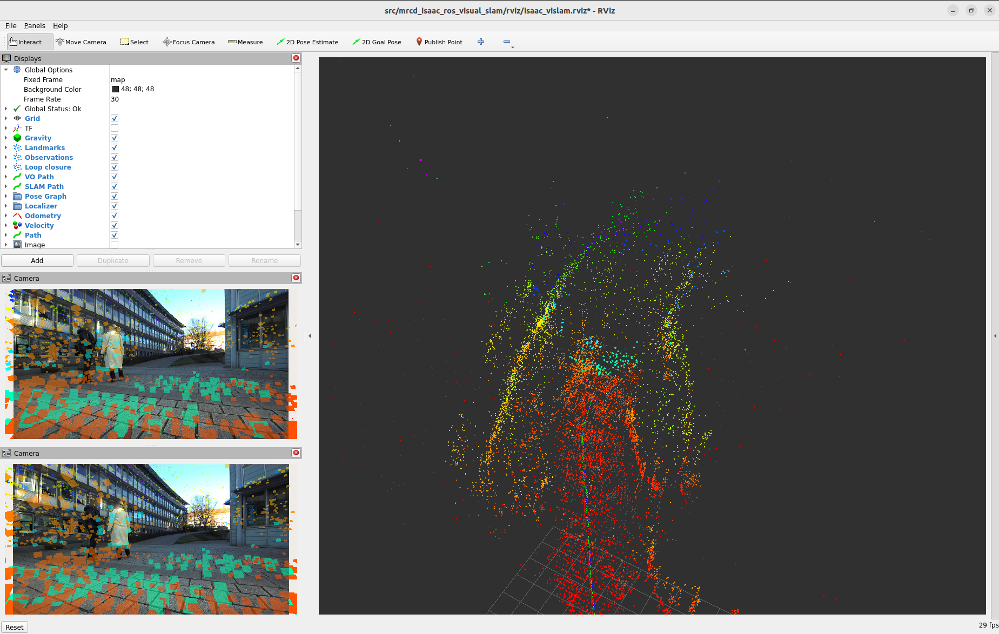

# SLAM Tutorial
MRCD was tested using a handful of state-of-the-art SLAM algorithms, which demonstrate the capabilities of the recorded dataset. We provide separate ROS2-Humble Docker images for all algorithms used in our paper, which can be downloaded on our [download](./download.md#docker-images) page. Below we provide step-by-step instructions on how to use the Docker images and how to run the SLAM algorithms on the dataset. You may want to check if the repositories in the list above have been updated. For example, the repository that we used for ORB SLAM3 features instable stereo-inertial SLAM at this time.

### Docker for MRCD
First, follow the official install instructions for docker for [Debian](https://docs.docker.com/engine/install/debian/). Next, navigate to the directory where you downloaded the MRCD images. To create an image based on the downloaded archive, run
```bash
sudo docker import <archive_name>.tar <image_name>:<image_version>
```
* Substitute:
    * `<archive_name>`: Name of the downloaded docker archive.
    * `<image_name>`: Name under which the image should be saved on your machine.
    * `<image_version>`: Version of the generated image. Defaults to 'latest'.

Check the list of images available on your machine with the command
```
sudo docker images
```

To start a container, please consider the individual instructions for each SLAM algorithm below. To able to visualize the results in RViz, you might have to run the following commands prior:
```bash
xhost + &> /dev/null
export DISPLAY=:0 # or :1
export XAUTHORITY=/home/<your_username>/.Xauthority
```

You can start an existing container with
```bash
sudo docker container start <container_name>
```

To open a terminal inside the container, run

```bash
sudo docker exec -it <container_name> bash
```

---

## LiDAR-Inertial SLAM

### [Nav2 SLAM Toolbox](https://github.com/SteveMacenski/slam_toolbox)

* Navigate to the directory containing the SLAM Toolbox docker container archive and run the following command to convert the archive into a runnable docker container. 
* Substitute:
    * `<image_name>`: Name under which the image should be saved on your machine.
    * `<image_version>`: Version of the generated image. Defaults to 'latest'.

```bash
sudo docker import mrcd_slamtoolbox_container.tar <image_name>:<image_version>
```

* Run the imported image as a docker container with the following command. 
* Substitute:
    * `<path_to_bag_files>`: Path to directory holding the downloaded dataset sequences.
    * `<container_name>`: Name under which the container should be saved on your machine.
    * `<image_name>`: Image name selected in previous step.
    * `<image_version>`: Image version selected in previous step.

```bash
sudo docker container run -it \
    -v <path_to_bag_files>:/dataset_files/ \
    --name <container_name> \
    --net=host \
    --privileged \
    --env="DISPLAY=$DISPLAY" \
    --volume="${XAUTHORITY}:/root/.Xauthority" \
    <image_name>:<image_version> \
    bash
```

* Open additional 3 additional terminals for the running container.
* Substitute:
    * `<container_name>`: Container name selected in previous step.
* Note: The container automatically opens inside the underlying ROS2 workspace and sources the relevant `setup.bash` files.

```bash
docker exec -it <container_name> bash
```

* Launch the following nodes in separate terminals:
* Substitute:
    * `<path_to_bagfile>`: Path to directory of the bagfile to play inside the previously mounted volume.

```bash
# Basic EKF Node to provide the SLAM Toolbox with an `odom` frame 
ros2 launch mrcd_slam_toolbox simple_ekf.launch.py 

# SLAM Toolbox launch
ros2 launch mrcd_slam_toolbox slam_toolbox_launch_online_sync.launch.py

# Launch preconfigured RViz visualization
ros2 launch mrcd_slam_toolbox rviz.launch

# Play bagfile
ros2 bag play /dataset_files/<path_to_bagfile> --clock
```

<br>

---

### [Google Cartographer 2D & 3D](https://github.com/cartographer-project/cartographer)

```bash
sudo docker import mrcd_cartographer_container.tar <image_name>:<image_version>
```

* Run the imported image as a docker container with the following command. 
* Substitute:
    * `<path_to_bag_files>`: Path to directory holding the downloaded dataset sequences.
    * `<container_name>`: Name under which the container should be saved on your machine.
    * `<image_name>`: Image name selected in previous step.
    * `<image_version>`: Image version selected in previous step.

```bash
sudo docker container run -it \
    -v <path_to_bag_files>:/dataset_files/ \
    --name <container_name> \
    --net=host \
    --privileged \
    --env="DISPLAY=$DISPLAY" \
    --volume="${XAUTHORITY}:/root/.Xauthority" \
    <image_name>:<image_version> \
    bash
```

* Open additional additional terminals for the running container.
* Substitute:
    * `<container_name>`: Container name selected in previous step.
* Note: The container automatically opens inside the underlying ROS2 workspace and sources the relevant `setup.bash` files.

```bash
docker exec -it <container_name> bash
```

#### 2D Cartographer 
* For 2D SLAM run the following commands.
* Substitute:
    * `<path_to_bagfile>`: Path to directory of the bagfile to play inside the previously mounted volume.
* Note: The Cartographer is using additional offline optimization, which causes the algorithm to continue running for a while after the playback of the bagfile has stopped.

```bash
# Launch 2D Cartographer
ros2 launch mrcd_cartographer demo_backpack_2d.launch.py

# Play bagfile
ros2 bag play /dataset_files/<path_to_bagfile> --clock

############# After optimization step is done #######################
# Call service to finally adjust trajectory according to optimization
ros2 service call /mrcd_robot/finish_trajectory cartographer_ros_msgs/srv/FinishTrajectory

# Call service to query trajectory to evaluate
ros2 service call /mrcd_robot/trajectory_query cartographer_ros_msgs/srv/TrajectoryQuery
```

<br>


#### 3D Cartographer 

* For 3D SLAM run the following commands.
* Substitute:
    * `<path_to_bagfile>`: Path to directory of the bagfile to play inside the previously mounted volume.
* Note: The Cartographer is using additional offline optimization, which causes the algorithm to continue running for a while after the playback of the bagfile has stopped.

```bash
# Launch 3D Cartographer
ros2 launch mrcd_cartographer demo_backpack_3d.launch.py

# Play bagfile
ros2 bag play /dataset_files/<path_to_bagfile> --clock

############# After optimization step is done #######################
# Call service to finally adjust trajectory according to optimization
ros2 service call /mrcd_robot/finish_trajectory cartographer_ros_msgs/srv/FinishTrajectory

# Call service to query trajectory to evaluate
ros2 service call /mrcd_robot/trajectory_query cartographer_ros_msgs/srv/TrajectoryQuery
```

<br>

---

### [Fast LiDAR-Inertial Odometry (FAST-LIO)](https://github.com/hku-mars/FAST_LIO.git)

```bash
sudo docker import mrcd_fastlio_container.tar <image_name>:<image_version>
```

* Run the imported image as a docker container with the following command. 
* Substitute:
    * `<path_to_bag_files>`: Path to directory holding the downloaded dataset sequences.
    * `<container_name>`: Name under which the container should be saved on your machine.
    * `<image_name>`: Image name selected in previous step.
    * `<image_version>`: Image version selected in previous step.

```bash
sudo docker container run -it \
    -v <path_to_bag_files>:/dataset_files/ \
    --name <container_name> \
    --net=host \
    --privileged \
    --env="DISPLAY=$DISPLAY" \
    --volume="${XAUTHORITY}:/root/.Xauthority" \
    <image_name>:<image_version> \
    bash
```

* Open additional additional terminals for the running container.
* Substitute:
    * `<container_name>`: Container name selected in previous step.
* Note: The container automatically opens inside the underlying ROS2 workspace and sources the relevant `setup.bash` files.

```bash
docker exec -it <container_name> bash
```

* To start the 3D SLAM, run the following commands.
* Substitute:
    * `<path_to_bagfile>`: Path to directory of the bagfile to play inside the previously mounted volume.

```bash
# Launch FAST-LIO
ros2 launch mrcd_fast_lio2 mapping.launch.py

# Play bagfile
ros2 bag play /dataset_files/<path_to_bagfile> --clock

# Call service to save 3D Map after SLAM has finished
ros2 service call /mrcd_robot/map_save std_srvs/srv/Trigger
```

<br>

---

## Visual-Inertial SLAM

### [NVIDIA ISSAC ROS Visual SLAM](https://github.com/NVIDIA-ISAAC-ROS/isaac_ros_visual_slam)

* For running the NVIDIA Containers, the [NVIDIA Container Toolkit](https://docs.nvidia.com/datacenter/cloud-native/container-toolkit/latest/index.html) is used to achieve access to cuda and gpu acceleration.
* With the following run command, the gpu acceleration is allowed.
* Be aware that to run this container, a NVIDIA gpu and CUDA are required.
* Substitute:
    * `<path_to_bag_files>`: Path to directory holding the downloaded dataset sequences.
    * `<container_name>`: Name under which the container should be saved on your machine.
    * `<image_name>`: Image name selected in previous step.
    * `<image_version>`: Image version selected in previous step.
```bash
sudo docker container run -it \
    --runtime=nvidia \
    --gpus all \
    -v <path_to_bag_files>:/dataset_files/ \
    --name <container_name> \
    --net=host \
    --privileged \
    --env="DISPLAY=$DISPLAY" \
    --volume="${XAUTHORITY}:/root/.Xauthority" \
    <image_name>:<image_version> \
    bash
```

* To launch the nvidia Isaac ROS Visual SLAM, open 3 Terminals to the container and launch the following commands.
* Substitute:
    * `<path_to_bagfile>`: Path to directory of the bagfile to play inside the previously mounted volume.

```bash
# Launch Nvidia Isaac ROS Visual Slam
ros2 launch mrcd_isaac_ros_visual_slam mrcd_visual_slam_core.launch.py

# Play bagfile with tf remappings as the Slam node does not allow remapping on launch and with read ahead queue to accomodate large data volume through images
ros2 bag play -p /dataset_files/<path_to_bagfile> --remap /mrcd_robot/tf:=/tf /mrcd_robot/tf_static:=tf_static  --clock --read-ahead-queue-size 10000

# Launch preconfigured visualization
rviz2 -d src/mrcd_isaac_ros_visual_slam/rviz/isaac_vislam.rviz
```

<br>

---

### [Open Visual-Inertial Navigation System (OpenVINS)](https://github.com/rpng/open_vins/tree/master)

* After creating the OpenVINS image you can run a container with the following command
* Substitute
    * `<path_to_bag_files>`: Path to directory holding the downloaded dataset sequences.
    * `<container_name>`: Name under which the container should be saved on your machine.
    * `<image_name>`: Image name selected in previous step.
    * `<image_version>`: Image version selected in previous step.

```bash
sudo docker container run -it \
    -v <path_to_bag_files>:/dataset_files/ \
    --name <container_name> \
    --net=host \
    --gpus all \
    --privileged \
    --env=\"NVIDIA_DRIVER_CAPABILITIES=all\" \
    --env=\"QT_X11_NO_MITSHM=1\" \
    --env="DISPLAY=$DISPLAY" \
    --volume=\"/tmp/.X11-unix:/tmp/.X11-unix:rw\" \
    <image_name>:<image_version> \
    bash
```

* OpenVINS package can be found in the ROS2 workspace
```bash
cd /ros2_ws/src/open_vins
```
* Build and source using the following command
```bash
colcon build --event-handlers console_cohesion+ && source install/setup.bash
```
* To run OpenVINS, you will need two terminals, one for the OpenVINS node and one for the bag playback.
* Substitute:
    * `<path_to_bagfile>`: Path to directory of the bagfile to play inside the previously mounted volume.

```bash
# Launch OpenVINS
ros2 launch ov_msckf subscribe_mrcd.launch.py

# Play bagfile
ros2 bag play -p /dataset_files/<path_to_bagfile> --clock --read-ahead-queue-size 10000
```

---

### [Real-Time Appearance-Based Mapping (RTAB-map)](https://github.com/introlab/rtabmap_ros)
* Note that we used the same container as for the NVIDIA ISSAC ROS Visual SLAM.
* With the following run command, the gpu acceleration is allowed.
* Be aware that to run this container, a NVIDIA gpu and CUDA are required.
* Substitute:
    * `<path_to_bag_files>`: Path to directory holding the downloaded dataset sequences.
    * `<container_name>`: Name under which the RTAB-map container should be saved on your machine.
    * `<image_name>`: Image name of RTAB-map image.
    * `<image_version>`: Image version of RTAB-map image.
```bash
sudo docker container run -it \
    --runtime=nvidia \
    --gpus all \
    -v <path_to_bag_files>:/dataset_files/ \
    --name <container_name> \
    --net=host \
    --privileged \
    --env="DISPLAY=$DISPLAY" \
    --volume="${XAUTHORITY}:/root/.Xauthority" \
    <image_name>:<image_version> \
    bash
```

* You will find the RTAB-map package in the ROS2 workspace.
```bash
cd /workspaces/ros2_ws/src/rtabmap_ros
```

* Building (and Sourcing) is done with standard colcon build with symlink option. However as building takes some time, we recommend building `rtabmap_launch` package if you only edit launch configurations.
```bash
colcon build --symlink-install --packages-select rtabmap_launch && source install/setup.bash
```

* To run RTAB-map, you will need three terminals, one for the RTAB-map node, one for the bag playback and for launching Image rectification node of NVIDIA ISSAC ROS (which is why we deploy NVIDIA ISAAC ROS container).
* Substitute:
    * `<path_to_bagfile>`: Path to directory of the bagfile to play inside the previously mounted volume.

```bash
# Launch RTAB-map
ros2 launch rtabmap_launch mrcd_rtabmap.launch.py use_sim_time:=true approx_sync:=true

# Play bagfile
ros2 bag play -p /dataset_files/<path_to_bagfile> --clock --read-ahead-queue-size 10000

# Launch Image rectification node
ros2 launch rtabmap_launch image_rect.launch.py
```
---

## Visual SLAM
### [ORB-SLAM-3 (ORB-SLAM3-ROS2)](https://github.com/jnskkmhr/orbslam3)
* After creating the ORB-SLAM3 image you can run a container with the following command
* Substitute
    * `<path_to_bag_files>`: Path to directory holding the downloaded dataset sequences.
    * `<container_name>`: Name under which the container should be saved on your machine.
    * `<image_name>`: Image name selected in previous step.
    * `<image_version>`: Image version selected in previous step.

```bash
sudo docker container run --init -it \
    -e DISPLAY=$DISPLAY \
    -v /tmp/.X11-unix:/tmp/.X11-unix:ro \
    --privileged \
    --net=host \
    --name <container_name> \
    -v <path_to_bag_files>:/dataset_files/ \
    <image_name>:<image_version> \
    bash
```

* ROS2 workspace can be entered with
```bash
cd /colcon_ws/
```

* Build ORB3 package and source using the following command
```bash
colcon build --cmake-args -DCMAKE_CXX_FLAGS="-w" --symlink-install --packages-select orbslam3_jns && source install/setup.bash
```

* To run ORB-SLAM3, you will need two terminals, one for the ORB-SLAM3 node and one for the bag playback.
* Substitute:
    * `<path_to_bagfile>`: Path to directory of the bagfile to play inside the previously mounted volume.

```bash
# Launch ORB-SLAM3
ros2 launch orbslam3_jns mrcd_stereo.launch.yaml

# Play bagfile
ros2 bag play -p /dataset_files/<path_to_bagfile> --clock --read-ahead-queue-size 10000
```