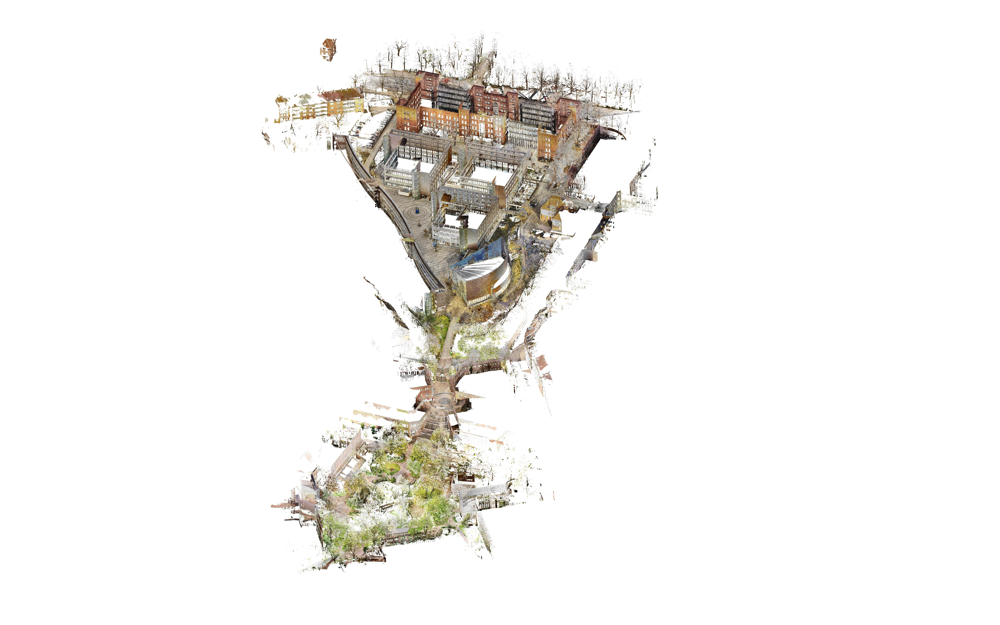
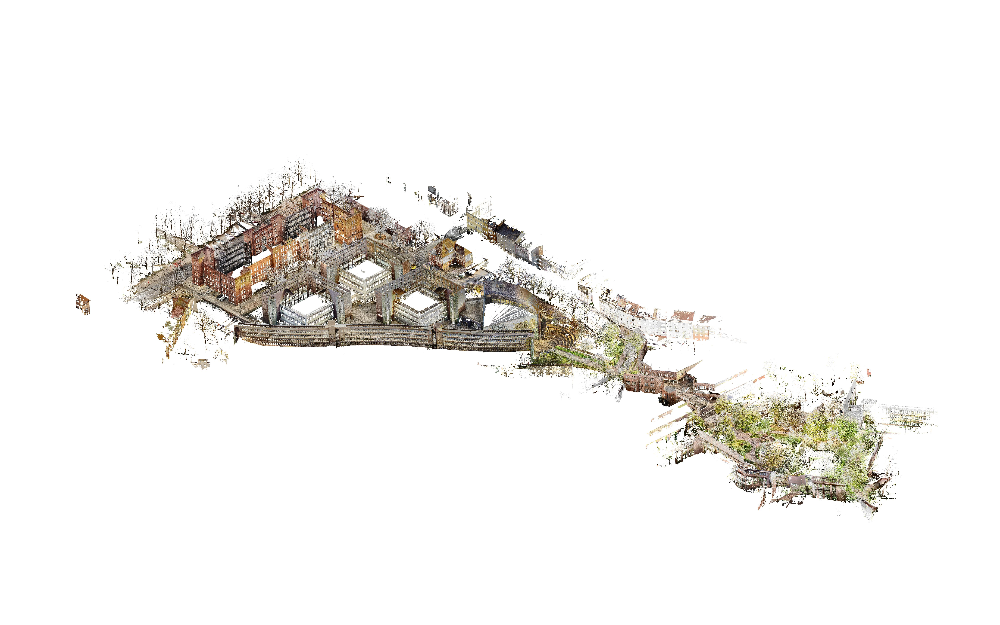

# About MRCD
Our dataset was recorded in ROS2 Humble. We recorded a total of 8 sequences in a campus environment. The dataset features a variety of challenging outdoor sequences for outdoor mobile robots. All sequences can be downloaded from the [Download](./download.md#dataset) page.

---

## Hardware Specifications
- Four-wheeld robot platform [Clearpath Jackal UGV](https://clearpathrobotics.com/jackal-small-unmanned-ground-vehicle/)
- Forward-facing camera [Zed2 Stereo Camera](https://www.stereolabs.com/en-de/products/zed-2)
- Top LiDAR [Velodyne VLP-16 LiDAR](https://ouster.com/products/hardware/vlp-16)
- Ground-facing camera [Intel Realsense D435](https://www.intelrealsense.com/depth-camera-d435/)
- Top RTK-GNSS Module [Emlid Reach M2](https://emlid.com/de/reach/)

---

## Available Topics
| Topic Name | Type | Frequency (Hz) |
|------------|------|----------------|
|*/ground\_truth*| [nav\_msgs/msg/Path](https://docs.ros.org/en/noetic/api/nav_msgs/html/msg/Path.html) | 30
|*/platform/dynamic\-joint\_states*| [control\_msgs/msg/DynamicJointState](https://docs.ros.org/en/ros2_packages/rolling/api/control_msgs/msg/DynamicJointState.html) | 50  
|*/platform/joint\_states*| [sensor\_msgs/msg/JointState](https://docs.ros.org/en/noetic/api/sensor_msgs/html/msg/JointState.html) | 50  
|*/platform/odom*| [nav\_msgs/msg/Odometry](https://docs.ros.org/en/noetic/api/nav_msgs/html/msg/Odometry.html) | 50  
|*/platform/odom/filtered*| [nav\_msgs/msg/Odometry](https://docs.ros.org/en/noetic/api/nav_msgs/html/msg/Odometry.html) | 50  
|*/cmd\_vel\_teleop*| [geometry\_msgs/msg/Twist](https://docs.ros.org/en/noetic/api/geometry_msgs/html/msg/Twist.html) | 20  
|*/teleop/joy*| [sensor\_msg/Joy](https://docs.ros.org/en/noetic/api/sensor_msgs/html/msg/Joy.html) | 180  
|*/tf*| [tf2\_msgs/msg/TFMessage](https://docs.ros.org/en/noetic/api/tf2_msgs/html/msg/TFMessage.html) | 228  
|*/tf\_static*| [tf2\_msgs/msg/TFMessage](https://docs.ros.org/en/noetic/api/tf2_msgs/html/msg/TFMessage.html) | 0.001
|
|*/scan*| [sensor\_msg/LaserScan](https://docs.ros.org/en/noetic/api/sensor_msgs/html/msg/LaserScan.html) | 10  
|*/velodyne\_points*| [sensor\_msgs/msg/PointCloud2](https://docs.ros.org/en/noetic/api/sensor_msgs/html/msg/PointCloud2.html) | 10  
|*/velodyne\_packets*| [velodyne\_msgs/msg/VelodyneScan](https://docs.ros.org/en/noetic/api/velodyne_msgs/html/msg/VelodyneScan.html) | 10  
|
|*/rs\_front/rs\_front/aligned\_depth\_to\_color/camera\_info*| [sensor\_msgs/msg/CameraInfo](https://docs.ros.org/en/noetic/api/sensor_msgs/html/msg/CameraInfo.html) | 15  
|*/rs\_front/rs\_front/aligned\_depth\_to\_color/image\_raw*| [sensor\_msgs/msg/Image](https://docs.ros.org/en/noetic/api/sensor_msgs/html/msg/Image.html) | 15  
|*/rs\_front/rs\_front/color/camera\_info*| [sensor\_msgs/msg/Image](https://docs.ros.org/en/noetic/api/sensor_msgs/html/msg/Image.html) | 30  
|*/rs\_front/rs\_front/color/image\_raw*| [sensor\_msgs/msg/Image](https://docs.ros.org/en/noetic/api/sensor_msgs/html/msg/Image.html) | 30  
|*rs\_front/rs\_front/color/metadata*| [realsense2\_camera\_msgs/msg/Metadata](https://docs.ros.org/en/noetic/api/realsense2_camera/html/msg/Metadata.html) | 30  
|*/rs\_front/rs\_front/depth/camera\_info*| [sensor\_msgs/msg/CameraInfo](https://docs.ros.org/en/noetic/api/sensor_msgs/html/msg/CameraInfo.html) | 15  
|*/rs\_front/rs\_front/depth/color/points*| [sensor\_msgs/msg/PointCloud2](https://docs.ros.org/en/noetic/api/sensor_msgs/html/msg/PointCloud2.html) | 15  
|*/rs\_front/rs\_front/depth/image\_rect\_raw*| [sensor\_msgs/msg/Image](https://docs.ros.org/en/noetic/api/sensor_msgs/html/msg/Image.html) | 15  
|
|*/rtk\_gnss/tcpfix*| [sensor\_msgs/msg/NavSatFix](https://docs.ros.org/en/noetic/api/sensor_msgs/html/msg/NavSatFix.html) | 5  
|*/rtk\_gnss/tcpvel*| [sensor\_msgs/msg/TwistStamped](https://docs.ros.org/en/noetic/api/geometry_msgs/html/msg/TwistStamped.html) | 5  
|
|*/zed\_node/imu/data\_raw*| [sensor\_msgs/msg/Imu](https://docs.ros.org/en/noetic/api/sensor_msgs/html/msg/Imu.html) | 200  
|*/zed\_node/imu/mag*| [sensor\_msgs/msg/MagneticField](https://docs.ros.org/en/noetic/api/sensor_msgs/html/msg/MagneticField.html) | 50  
|*/zed\_node/left\_raw/camera\_info*| [sensor\_msgs/msg/ CameraInfo](https://docs.ros.org/en/noetic/api/sensor_msgs/html/msg/CameraInfo.html) | 30  
|*/zed\_node/left\_raw/image\_raw\_color*| [sensor\_msgs/msg/Image](https://docs.ros.org/en/noetic/api/sensor_msgs/html/msg/Image.html) | 30  
|*/zed\_node/right\_raw/camera\_info*| [sensor\_msgs/msg/ CameraInfo](https://docs.ros.org/en/noetic/api/sensor_msgs/html/msg/CameraInfo.html) | 30  
|*/zed\_node/right\_raw/image\_raw\_color*| [sensor\_msgs/msg/Image](https://docs.ros.org/en/noetic/api/sensor_msgs/html/msg/Image.html) | 30  
|*/zed\_node/odom*| [nav\_msgs/msg/Odometry](https://docs.ros.org/en/noetic/api/nav_msgs/html/msg/Odometry.html) | 30  
|*/zed\_node/path\_map*| [nav\_msgs/msg/Path](https://docs.ros.org/en/noetic/api/nav_msgs/html/msg/Path.html) | 2  
|*/zed\_node/path\_odom*| [nav\_msgs/msg/path](https://docs.ros.org/en/noetic/api/nav_msgs/html/msg/Path.html) | 2  
|*/zed\_node/point\_cloud/cloud\_registered*| [sensor\_msgs/msg/PointCloud2](https://docs.ros.org/en/noetic/api/sensor_msgs/html/msg/PointCloud2.html) | 10  
|*/zed\_node/pose*| [geometry\_msgs/msg/PoseStamped](https://docs.ros.org/en/noetic/api/geometry_msgs/html/msg/PoseStamped.html) | 30  
|*/zed\_node/pose\_with\_covariance*| [geometry\_msgs/msg/PoseWithCovarianceStamped](https://docs.ros.org/en/noetic/api/geometry_msgs/html/msg/PoseWithCovarianceStamped.html) | 30  

---

## Ground Truth
As you see in the table above, MRCD contains a topic for discrete gound truth. Our ground truth is based on B-splines (for further information we recommend the works of [Sommer & Usenko](https://openaccess.thecvf.com/content_CVPR_2020/papers/Sommer_Efficient_Derivative_Computation_for_Cumulative_B-Splines_on_Lie_Groups_CVPR_2020_paper.pdf) and [Nguyen](https://mcdviral.github.io/images/bspline_technical_note.pdf)). For external downloads, both continuous- and discrete-time ground truth sampled with 10 Hz, please visit our [Download](./download.md#sequences) page.

**Discrete time ground truth** is recommended for traditional benchmark evaluation. For this purpose, you can use *sampled-10Hz.csv* files. A snippet is given below.

```
# t, x, y, z, qx, qy, qz, qw
1733232244.216223,-11.381495,419.831974,13.050092,-0.001421,0.002207,0.986825,0.161768
1733232244.316222,-11.380007,419.838220,13.049208,-0.001452,0.002527,0.986845,0.161641
1733232244.416222,-11.376395,419.840031,13.049060,-0.001391,0.002309,0.986843,0.161660
1733232244.516222,-11.376447,419.839133,13.048638,-0.001201,0.002303,0.986867,0.161513
```

**Continuous-time Ground Truth** is provided in the form of B-splines in files named *spline.csv*, which contain a list of *control points*. Please find a snippet below. For reading the *spline.csv* files, we refer to the example Python script in [MCD](https://mcdviral.github.io/Groundtruth.html). In addition, please find our docker image for running the script in our [Download](./download.md#sequences) page.

```
Dt: 0.01, Order: 4, Knots: 18630, MinTime: 1733232244.216222, MaxTime: 1733232430.486222, OtrItr: 0
0,1733232244.216222,-11.38167635118966,419.831709573794,13.04996049864827,-0.001487913908807536,0.002282587900610606,0.9867893981649208,0.1619853683947698
1,1733232244.226222,-11.38149436097049,419.8319735971247,13.05009187779725,-0.00142456389288367,0.002201660148280774,0.9868312052885267,0.1617321723687045
2,1733232244.236222,-11.38131456689262,419.8322401513307,13.0502227986052,-0.001339607412260437,0.002152985618908402,0.9868380617679345,0.1616917126850109
3,1733232244.246222,-11.38113488883607,419.832506908778,13.05035379930804,-0.001305077430043593,0.002090431447356799,0.9868645309147559,0.1615311873653645
```

---

## Survey-Grade Prior Map
Ground truth trajectories are derived from a survey-grade prior map of the campus environment. The map is constructed via stitching of pointclouds that have been recorded on campus. As the campus consists of a northern and southern area, two separate pointclouds have been created. The map is available for download from the [Download](./download.md#survey-grade-prior-map) page.

<br>
**Northern campus pointcloud**
<br>
**Northern campus pointcloud**
